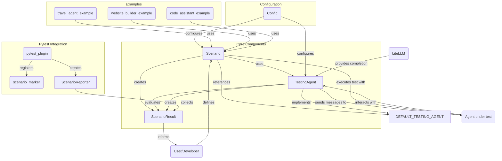
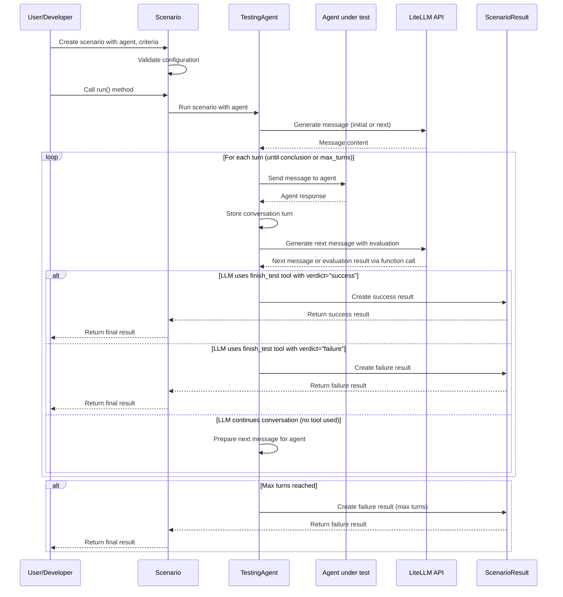

# Contributing to Scenario

Thank you for your interest in contributing to Scenario! This document provides guidelines and instructions for contributing to the project.

## Table of Contents

- [Architecture Overview](#architecture-overview)
- [File Structure](#file-structure)
- [Data and Control Flow](#data-and-control-flow)
- [Development Setup](#development-setup)
- [Coding Standards](#coding-standards)
- [Testing](#testing)
- [Common Contribution Types](#common-contribution-types)
- [Troubleshooting](#troubleshooting)
- [Pull Request Process](#pull-request-process)
- [Documentation](#documentation)

## Architecture Overview

Below is a diagram of the main components of Scenario and how they interact:



### Component Descriptions

#### Core Components

- **Scenario**: The central class that defines a test case for an agent, including description, success/failure criteria, and testing strategy.
- **TestingAgent**: Handles the conversation with the agent under test, generates messages based on the scenario, and evaluates responses.
- **ScenarioResult**: Stores the outcome of a test run, including conversation history, success/failure status, and artifacts.
- **DEFAULT_TESTING_AGENT**: A default instance of TestingAgent used when none is explicitly provided.

#### Configuration

- **Config**: Provides configuration options for models, temperatures, and other parameters used by the testing agent.

#### Pytest Integration

- **pytest_plugin**: Registers pytest fixtures and markers for integrating Scenario with pytest.
- **scenario_marker**: A pytest marker for identifying agent tests.
- **ScenarioReporter**: Collects and formats test results for reporting.

## File Structure

The project is organized as follows:

```mermaid
graph TD
    Root[scenario/] --> Setup[setup.py]
    Root --> Pyproject[pyproject.toml]
    Root --> ReadMe[README.md]
    Root --> Contrib[CONTRIBUTING.md]
    Root --> ScenarioDir[scenario/]
    Root --> ExamplesDir[examples/]
    Root --> Tests[tests/]

    ScenarioDir --> Init[__init__.py]
    ScenarioDir --> ScenarioMod[scenario.py]
    ScenarioDir --> TestingAgentMod[testing_agent.py]
    ScenarioDir --> ResultMod[result.py]
    ScenarioDir --> ConfigMod[config.py]
    ScenarioDir --> PytestPluginMod[pytest_plugin.py]

    ExamplesDir --> ExInit[__init__.py]
    ExamplesDir --> TravelEx[test_travel_agent.py]
    ExamplesDir --> WebsiteEx[test_website_builder.py]
    ExamplesDir --> CodeEx[test_code_assistant.py]
    ExamplesDir --> EarlyStopEx[test_early_stopping.py]
    ExamplesDir --> ExReadMe[README.md]
    ExamplesDir --> TestData[test_data/]

    Tests --> TestsInit[__init__.py]
    Tests --> ScenarioTests[test_scenario.py]
    Tests --> AgentTests[test_testing_agent.py]
    Tests --> ResultTests[test_result.py]
    Tests --> ConfigTests[test_config.py]
    Tests --> ExampleTests[test_example.py]
    Tests --> CustomValidation[custom_validation_example.py]
```



### Key Files

- **scenario.py**: Contains the `Scenario` class definition
- **testing_agent.py**: Contains the `TestingAgent` class and `DEFAULT_TESTING_AGENT` instance
- **result.py**: Contains the `ScenarioResult` class for storing test outcomes
- **config.py**: Provides configuration options for the testing framework
- **pytest_plugin.py**: Integration with pytest
- **examples/**: Contains example implementations and tests

## Data and Control Flow

The following diagram shows the detailed data and control flow during a typical test execution:



### Key Processes

1. **Scenario Creation and Configuration**:
   - User defines a scenario with description, success/failure criteria, strategy, etc.
   - User specifies the agent to test and optionally a custom testing agent

2. **Test Execution**:
   - The `Scenario.run()` method is called, which delegates to a TestingAgent
   - TestingAgent generates messages based on the scenario description and strategy
   - TestingAgent manages a multi-turn conversation with the agent under test

3. **Message Generation and Evaluation**:
   - A single method `_generate_next_message` handles both initial and subsequent messages
   - The method adapts its behavior based on whether it's generating the first message or evaluating responses
   - For the first message, it creates a simple prompt to start the conversation
   - For subsequent messages, it performs evaluation and can either continue the conversation or end the test

4. **Evaluation Process**:
   - After each agent response, the TestingAgent evaluates the conversation against success/failure criteria
   - The TestingAgent can decide to:
     - Continue the conversation with a new message
     - Complete the test as a success with a detailed explanation
     - Complete the test as a failure with a detailed explanation (especially when failure criteria are met)
   - The decision is facilitated through a function-calling mechanism where the LLM can invoke a `finish_test` tool

5. **Early Stopping**:
   - A key feature is early stopping when failure criteria are met, preventing unnecessary conversation turns
   - Failure criteria are given priority in evaluation, allowing immediate test termination when triggered

## Development Setup

1. **Clone the repository**:
```bash
git clone https://github.com/yourusername/scenario.git
cd scenario
```

2. **Install dependencies and set up git hooks**:
```bash
make install
```

This will:
- Install all dependencies using `uv`
- Set up pre-commit hooks for code quality
- **Install conventional commit enforcement** - commits must follow the format: `feat:`, `fix:`, `chore:`, etc.

3. **Run tests**:
```bash
make test
```

### Running Examples

The project includes a Makefile with commands to simplify running examples and tests:

1. **Running a specific example**:
```bash
# Run a specific example
make example examples/test_vegetarian_recipe_agent.py
```

2. **Running tests**:
```bash
# Run all tests
make test

# Run a specific test
make test tests/test_scenario.py
```

The examples will produce a colorized report showing test results, success criteria met, and any failures.

## Coding Standards

- Follow PEP 8 guidelines for Python code
- Use type hints for all function parameters and return values
- Write docstrings for all classes and functions
- Keep functions focused on a single responsibility
- Use meaningful variable and function names

## Testing

- Add tests for any new functionality
- Ensure all tests pass before submitting a pull request
- Use pytest fixtures to avoid code duplication in tests
- Include both unit tests and integration tests where appropriate

## Common Contribution Types

### 1. Adding a New Feature

When adding a new feature to Scenario, follow these steps:

1. **Discuss First**: Open an issue to discuss the proposed feature before implementation
2. **Design**: Create a simple design doc or diagram if it's a complex feature
3. **Implementation**: Follow the code style and add appropriate tests
4. **Documentation**: Update README.md and add docstrings

Example features that would be useful:
- Support for additional LLM providers
- New validation strategies for specific agent types
- Enhanced reporting formats
- Support for parallel testing

### 2. Fixing Bugs

When fixing a bug:

1. **Create an Issue**: Start by creating an issue that describes the bug
2. **Reproduce**: Add a test that reproduces the bug if possible
3. **Fix**: Implement the fix
4. **Test**: Make sure all tests pass
5. **Document**: Update any affected documentation

### 3. Improving the TestingAgent

The TestingAgent is a key component of Scenario. Improvements might include:

1. **Enhanced Prompts**: Improving the prompts used for evaluation
2. **Better Evaluation**: Making the evaluation of success/failure criteria more accurate
3. **Custom Function Calls**: Adding new tools for the TestingAgent to use during evaluation
4. **Fallback Strategies**: Adding fallback strategies when LLM calls fail
5. **Efficiency**: Optimizing token usage or reducing API calls

### 4. Adding Examples

Examples help users understand how to use Scenario. When adding an example:

1. **Choose a Use Case**: Pick a practical use case that demonstrates Scenario's capabilities
2. **Create Agent**: Implement a simple agent for testing
3. **Write Tests**: Create test scenarios that demonstrate testing the agent
4. **Document**: Add comments and explanation to make the example clear

## Troubleshooting

### Common Issues and Solutions

#### LLM API Issues

**Problem**: LLM API calls fail or return unexpected results
**Solution**:
- Check your API key and environment variables
- Verify the model name is supported by your provider
- Try reducing the complexity of your prompts

#### Circular Import Errors

**Problem**: Circular import errors when importing from scenario modules
**Solution**:
- Follow the import order in `__init__.py`
- Use type comments instead of annotations for circular references
- Import types at runtime when needed

#### Test Failures with pytest

**Problem**: Tests marked with `@pytest.mark.agent_test` are not being collected
**Solution**:
- Make sure the pytest plugin is properly registered
- Check that your pytest configuration includes the marker
- Verify the scenario_reporter fixture is available

#### Inconsistent LLM Responses

**Problem**: Tests are flaky due to non-deterministic LLM responses
**Solution**:
- Lower the temperature setting in the TestingAgent configuration
- Make success/failure criteria more specific
- Consider using deterministic mocks for testing framework components

#### Tool Calling Issues

**Problem**: The TestingAgent doesn't properly use the finish_test tool
**Solution**:
- Check that your LLM model supports function calling
- Make sure the tool schema is defined correctly
- Review the prompt to ensure it clearly instructs when to use the tool

### Debugging Tips

1. **Logging**: Enable DEBUG level logging to see detailed information about LLM calls
```python
import logging
logging.basicConfig(level=logging.DEBUG)
```

2. **Conversation Inspection**: Examine the conversation history in ScenarioResult
```python
result = scenario.run()
for msg in result.conversation:
    print(f"{msg['role']}: {msg['content'][:100]}...")
```

3. **LLM Response Inspection**: Check raw responses from the LLM provider
```python
# Add this to testing_agent.py temporarily
print(f"Raw LLM response: {response}")
```

4. **Tool Call Inspection**: Examine function calls made by the LLM
```python
# Add this to testing_agent.py temporarily
if hasattr(response.choices[0].message, 'tool_calls'):
    print(f"Tool calls: {response.choices[0].message.tool_calls}")
```

## Pull Request Process

1. Fork the repository and create a new branch from `main`
2. Make your changes and add tests for new functionality
3. Update documentation as needed
4. Run all tests to ensure they pass
5. Submit a pull request with a clear description of the changes

## Documentation

- Update README.md when adding significant new features
- Add docstrings to all public classes and functions
- Include examples for complex functionality
- When adding new components, update the architecture diagram in this document

## Extension Points

If you're looking to extend Scenario, here are some key areas to consider:

1. **Custom Testing Agents**: You can create specialized testing agents for specific types of applications.
2. **Additional Validation Functions**: Implement custom validation logic for domain-specific tests.
3. **New Reporting Formats**: Extend the reporting capabilities for different output formats.
4. **Integration with Other Testing Frameworks**: Add integrations beyond pytest.
5. **Custom LLM Tools**: Define new function-calling tools for the testing agent to use.

## License

By contributing to Scenario, you agree that your contributions will be licensed under the project's MIT License.
