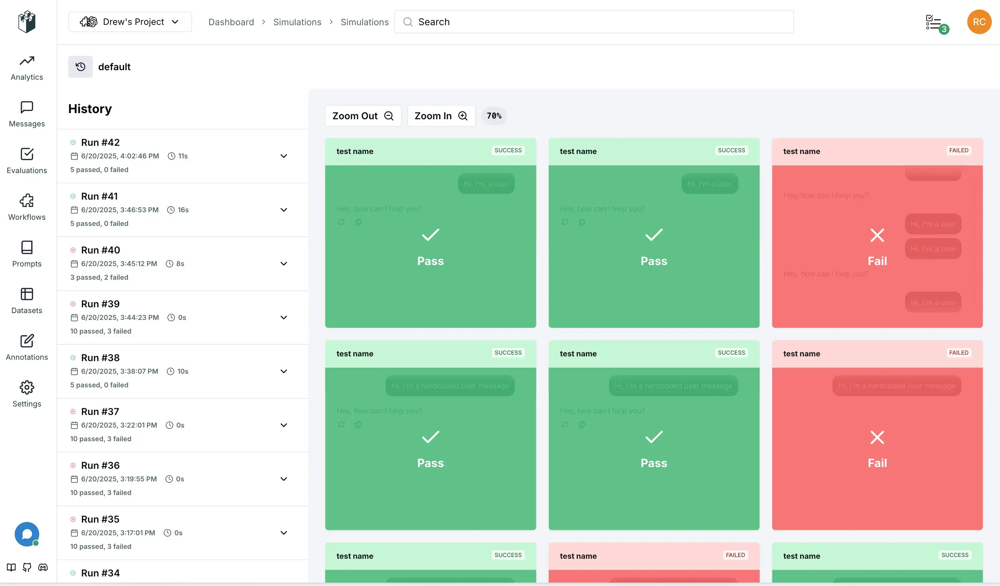

<p align="center">
    <a href="https://discord.gg/kT4PhDS2gH" target="_blank"></a>
    <a href="https://pypi.python.org/pypi/langwatch-scenario" target="_blank"></a>
    <a href="https://www.npmjs.com/package/@langwatch/scenario" target="_blank"></a>
    <a href="https://github.com/langwatch/scenario/actions/workflows/python-ci.yml"></a>
    <a href="https://github.com/langwatch/scenario/actions/workflows/javascript-ci.yml"></a>
    <a href="https://twitter.com/intent/follow?screen_name=langwatchai" target="_blank">
    </a>
</p>

# Scenario

Scenario is an Agent Testing Framework based on simulations, it can:

- Test real agent behavior by simulating users in different scenarios and edge cases
- Evaluate and judge at any point of the conversation, powerful multi-turn control
- Combine it with any LLM eval framework or custom evals, agnostic by design
- Integrate your Agent by implementing just one [`call()`](https://scenario.langwatch.ai/agent-integration) method
- Available in Python, TypeScript and Go

📖 [Documentation](https://scenario.langwatch.ai)\
📺 [Watch Video Tutorial](https://www.youtube.com/watch?v=f8NLpkY0Av4)

## Example

This is how a simulation with tool check looks like with Scenario:

```python
# Define any custom assertions
def check_for_weather_tool_call(state: scenario.ScenarioState):
    assert state.has_tool_call("get_current_weather")

result = await scenario.run(
    name="checking the weather",

    # Define the prompt to guide the simulation
    description="""
        The user is planning a boat trip from Barcelona to Rome,
        and is wondering what the weather will be like.
    """,

    # Define the agents that will play this simulation
    agents=[
        WeatherAgent(),
        scenario.UserSimulatorAgent(model="openai/gpt-4.1-mini"),
    ],

    # (Optional) Control the simulation
    script=[
        scenario.user(), # let the user simulator generate a user message
        scenario.agent(), # agent responds
        check_for_weather_tool_call, # check for tool call after the first agent response
        scenario.succeed(), # simulation ends successfully
    ],
)

assert result.success
```

<details>
<summary><strong>TypeScript Example</strong></summary>

```typescript
const result = await scenario.run({
  name: "vegetarian recipe agent",

  // Define the prompt to guide the simulation
  description: `
    The user is planning a boat trip from Barcelona to Rome,
    and is wondering what the weather will be like.
  `,

  // Define the agents that will play this simulation
  agents: [new MyAgent(), scenario.userSimulatorAgent()],

  // (Optional) Control the simulation
  script: [
    scenario.user(), // let the user simulator generate a user message
    scenario.agent(), // agent responds
    // check for tool call after the first agent response
    (state) => expect(state.has_tool_call("get_current_weather")).toBe(true),
    scenario.succeed(), // simulation ends successfully
  ],
});
```

</details>

> [!NOTE]
> Check out full examples in the [python/examples folder](./python/examples/). or the [typescript/examples folder](./typescript/examples/).

## Quick Start

Install scenario and a test runner:

```bash
# on python
uv add langwatch-scenario pytest

# or on typescript
pnpm install @langwatch/scenario vitest
```

Now create your first scenario, copy the full working example below.

<details>
<summary><strong>Quick Start - Python</strong></summary>

Save it as `tests/test_vegetarian_recipe_agent.py`:

```python
import pytest
import scenario
import litellm

scenario.configure(default_model="openai/gpt-4.1-mini")


@pytest.mark.agent_test
@pytest.mark.asyncio
async def test_vegetarian_recipe_agent():
    class Agent(scenario.AgentAdapter):
        async def call(self, input: scenario.AgentInput) -> scenario.AgentReturnTypes:
            return vegetarian_recipe_agent(input.messages)

    # Run a simulation scenario
    result = await scenario.run(
        name="dinner idea",
        description="""
            It's saturday evening, the user is very hungry and tired,
            but have no money to order out, so they are looking for a recipe.
        """,
        agents=[
            Agent(),
            scenario.UserSimulatorAgent(),
            scenario.JudgeAgent(
                criteria=[
                    "Agent should not ask more than two follow-up questions",
                    "Agent should generate a recipe",
                    "Recipe should include a list of ingredients",
                    "Recipe should include step-by-step cooking instructions",
                    "Recipe should be vegetarian and not include any sort of meat",
                ]
            ),
        ],
    )

    # Assert for pytest to know whether the test passed
    assert result.success


# Example agent implementation
import litellm


@scenario.cache()
def vegetarian_recipe_agent(messages) -> scenario.AgentReturnTypes:
    response = litellm.completion(
        model="openai/gpt-4.1-mini",
        messages=[
            {
                "role": "system",
                "content": """
                    You are a vegetarian recipe agent.
                    Given the user request, ask AT MOST ONE follow-up question,
                    then provide a complete recipe. Keep your responses concise and focused.
                """,
            },
            *messages,
        ],
    )

    return response.choices[0].message  # type: ignore
```

</details>

<details>
<summary><strong>Quick Start - TypeScript</strong></summary>

Save it as `tests/vegetarian-recipe-agent.test.ts`:

```typescript
import { openai } from "@ai-sdk/openai";
import * as scenario from "@langwatch/scenario";
import { generateText } from "ai";
import { describe, it, expect } from "vitest";

describe("Vegetarian Recipe Agent", () => {
  const agent: scenario.AgentAdapter = {
    role: scenario.AgentRole.AGENT,
    call: async (input) => {
      const response = await generateText({
        model: openai("gpt-4.1-mini"),
        messages: [
          {
            role: "system",
            content: `You are a vegetarian recipe agent.\nGiven the user request, ask AT MOST ONE follow-up question, then provide a complete recipe. Keep your responses concise and focused.`,
          },
          ...input.messages,
        ],
      });
      return response.text;
    },
  };

  it("should generate a vegetarian recipe for a hungry and tired user on a Saturday evening", async () => {
    const result = await scenario.run({
      name: "dinner idea",
      description: `It's saturday evening, the user is very hungry and tired, but have no money to order out, so they are looking for a recipe.`,
      agents: [
        agent,
        scenario.userSimulatorAgent(),
        scenario.judgeAgent({
          model: openai("gpt-4.1-mini"),
          criteria: [
            "Agent should not ask more than two follow-up questions",
            "Agent should generate a recipe",
            "Recipe should include a list of ingredients",
            "Recipe should include step-by-step cooking instructions",
            "Recipe should be vegetarian and not include any sort of meat",
          ],
        }),
      ],
    });
    expect(result.success).toBe(true);
  });
});
```

</details>

Export your OpenAI API key:

```bash
OPENAI_API_KEY=<your-api-key>
```

Now run it the test:

```bash
# on python
pytest -s tests/test_vegetarian_recipe_agent.py

# on typescript
npx vitest run tests/vegetarian-recipe-agent.test.ts
```

This is how it will look like:

[](https://asciinema.org/a/nvO5GWGzqKTTCd8gtNSezQw11)

You can find the same code example in [python/examples/](python/examples/test_vegetarian_recipe_agent.py) or [javascript/examples/](javascript/examples/vitest/tests/vegetarian-recipe-agent.test.ts).

Now check out the [full documentation](https://scenario.langwatch.ai) to learn more and next steps.

## Simulation on Autopilot

By providing a User Simulator Agent and a description of the Scenario without a script, the simulated user will automatically generate messages to the agent until the scenario is successful or the maximum number of turns is reached.

You can then use a Judge Agent to evaluate the scenario in real-time given certain criteria, at every turn, the Judge Agent will decide if it should let the simulation proceed or end it with a verdict.

For example, here is a scenario that tests a vibe coding assistant:

```python
result = await scenario.run(
    name="dog walking startup landing page",
    description="""
        the user wants to create a new landing page for their dog walking startup

        send the first message to generate the landing page, then a single follow up request to extend it, then give your final verdict
    """,
    agents=[
        LovableAgentAdapter(template_path=template_path),
        scenario.UserSimulatorAgent(),
        scenario.JudgeAgent(
            criteria=[
                "agent reads the files before go and making changes",
                "agent modified the index.css file, not only the Index.tsx file",
                "agent created a comprehensive landing page",
                "agent extended the landing page with a new section",
                "agent should NOT say it can't read the file",
                "agent should NOT produce incomplete code or be too lazy to finish",
            ],
        ),
    ],
    max_turns=5, # optional
)
```

Check out the fully working Lovable Clone example in [examples/test_lovable_clone.py](examples/test_lovable_clone.py).

You can also combine it with a partial script too! By for example controlling only the beginning of the conversation, and let the rest proceed on autopilot, see the next section.

## Full Control of the Conversation

You can specify a script for guiding the scenario by passing a list of steps to the `script` field, those steps are simply arbitrary functions that take the current state of the scenario as an argument, so you can do things like:

- Control what the user says, or let it be generated automatically
- Control what the agent says, or let it be generated automatically
- Add custom assertions, for example making sure a tool was called
- Add a custom evaluation, from an external library
- Let the simulation proceed for a certain number of turns, and evaluate at each new turn
- Trigger the judge agent to decide on a verdict
- Add arbitrary messages like mock tool calls in the middle of the conversation

Everything is possible, using the same simple structure:

```python
@pytest.mark.agent_test
@pytest.mark.asyncio
async def test_early_assumption_bias():
    result = await scenario.run(
        name="early assumption bias",
        description="""
            The agent makes false assumption that the user is talking about an ATM bank, and user corrects it that they actually mean river banks
        """,
        agents=[
            Agent(),
            scenario.UserSimulatorAgent(),
            scenario.JudgeAgent(
                criteria=[
                    "user should get good recommendations on river crossing",
                    "agent should NOT keep following up about ATM recommendation after user has corrected them that they are actually just hiking",
                ],
            ),
        ],
        max_turns=10,
        script=[
            # Define hardcoded messages
            scenario.agent("Hello, how can I help you today?"),
            scenario.user("how do I safely approach a bank?"),

            # Or let it be generated automatically
            scenario.agent(),

            # Add custom assertions, for example making sure a tool was called
            check_if_tool_was_called,

            # Generate a user follow-up message
            scenario.user(),

            # Let the simulation proceed for 2 more turns, print at every turn
            scenario.proceed(
                turns=2,
                on_turn=lambda state: print(f"Turn {state.current_turn}: {state.messages}"),
            ),

            # Time to make a judgment call
            scenario.judge(),
        ],
    )

    assert result.success
```

## LangWatch Visualization

Set your [LangWatch API key](https://app.langwatch.ai/) to visualize the scenarios in real-time, as they run, for a much better debugging experience and team collaboration:

```bash
LANGWATCH_API_KEY="your-api-key"
```



## Debug mode

You can enable debug mode by setting the `debug` field to `True` in the `Scenario.configure` method or in the specific scenario you are running, or by passing the `--debug` flag to pytest.

Debug mode allows you to see the messages in slow motion step by step, and intervene with your own inputs to debug your agent from the middle of the conversation.

```python
scenario.configure(default_model="openai/gpt-4.1-mini", debug=True)
```

or

```bash
pytest -s tests/test_vegetarian_recipe_agent.py --debug
```

## Cache

Each time the scenario runs, the testing agent might chose a different input to start, this is good to make sure it covers the variance of real users as well, however we understand that the non-deterministic nature of it might make it less repeatable, costly and harder to debug. To solve for it, you can use the `cache_key` field in the `Scenario.configure` method or in the specific scenario you are running, this will make the testing agent give the same input for given the same scenario:

```python
scenario.configure(default_model="openai/gpt-4.1-mini", cache_key="42")
```

To bust the cache, you can simply pass a different `cache_key`, disable it, or delete the cache files located at `~/.scenario/cache`.

To go a step further and fully cache the test end-to-end, you can also wrap the LLM calls or any other non-deterministic functions in your application side with the `@scenario.cache` decorator:

```python
# Inside your actual agent implementation
class MyAgent:
    @scenario.cache()
    def invoke(self, message, context):
        return client.chat.completions.create(
            # ...
        )
```

This will cache any function call you decorate when running the tests and make them repeatable, hashed by the function arguments, the scenario being executed, and the `cache_key` you provided. You can exclude arguments that should not be hashed for the cache key by naming them in the `ignore` argument.

## Disable Output

You can remove the `-s` flag from pytest to hide the output during test, which will only show up if the test fails. Alternatively, you can set `verbose=False` in the `Scenario.configure` method or in the specific scenario you are running.

## Running in parallel

As the number of your scenarios grows, you might want to run them in parallel to speed up your whole test suite. We suggest you to use the [pytest-asyncio-concurrent](https://pypi.org/project/pytest-asyncio-concurrent/) plugin to do so.

Simply install the plugin from the link above, then replace the `@pytest.mark.asyncio` annotation in the tests with `@pytest.mark.asyncio_concurrent`, adding a group name to it to mark the group of scenarions that should be run in parallel together, e.g.:

```python
@pytest.mark.agent_test
@pytest.mark.asyncio_concurrent(group="vegetarian_recipe_agent")
async def test_vegetarian_recipe_agent():
    # ...

@pytest.mark.agent_test
@pytest.mark.asyncio_concurrent(group="vegetarian_recipe_agent")
async def test_user_is_very_hungry():
    # ...
```

Those two scenarios should now run in parallel.

## Contributing

We welcome contributions! Please see our [Contributing Guide](CONTRIBUTING.md) for details.

## Support

- 📖 [Documentation](https://scenario.langwatch.ai)
- 💬 [Discord Community](https://discord.gg/langwatch)
- 🐛 [Issue Tracker](https://github.com/langwatch/scenario/issues)

## License

MIT License - see [LICENSE](LICENSE) for details.
